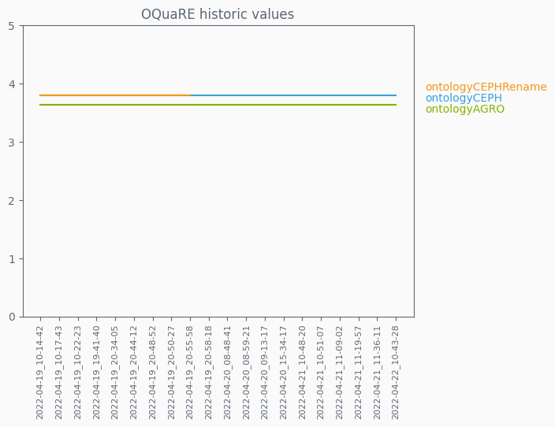

# OQuaRE metrics results
## OQuaRE model value
Represents the quality of the ontology when taking in all the values obtained after evaluation.On a scale of 1 to 5, 5 represents the highest quality attainable according to the OQuaRE framework

## OQuaRE historic model value
Progress of each analyzed ontology across the latest 20 versions on a scale of 1 to 5

