## OQuaRE category values
Each category has a value on a scale of 1 to 5, indicating how good the ontology is for each category

## OQuaRE subcategories metrics
Each category has a set of subcategories with metrics on a scale of 1 to 5, which makes up the category end value

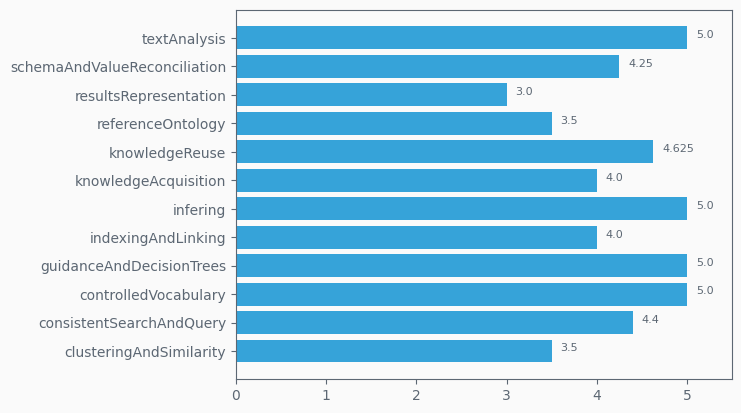
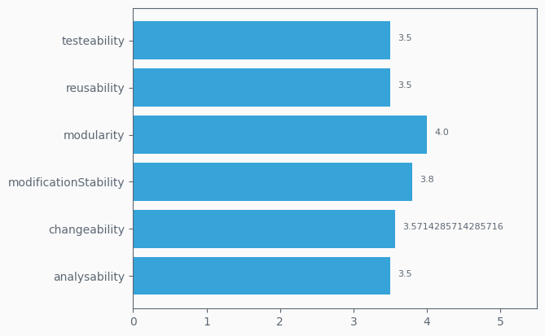

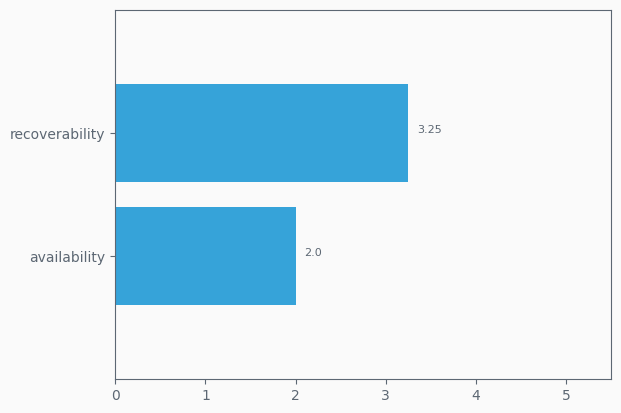
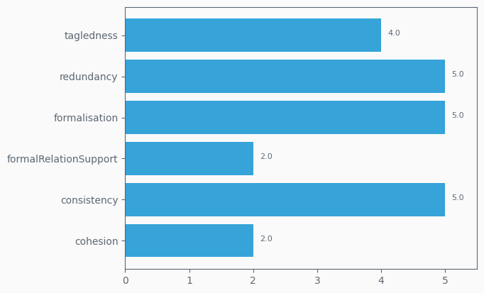

## OQuaRE metrics values
Fine grained metrics, lowest level of ontology analysis provided. Scaled version uses a 1 to 5 scale

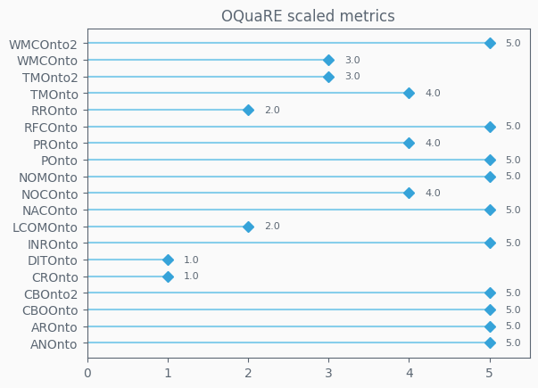
## OQuaRE category evolution
Evolution of each category overtime on a scale of 1 to 5

## OQuaRE metrics evolution
Evolution of each of the 19 metrics obtained from an ontology
### ANOnto evolution

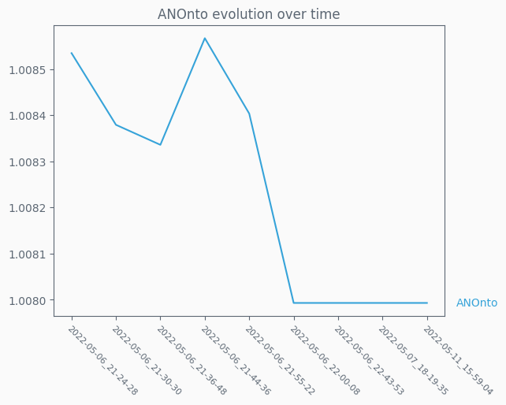

### AROnto evolution

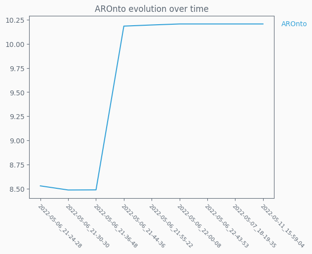

### CBOOnto evolution

### CBOnto2 evolution

### CROnto evolution

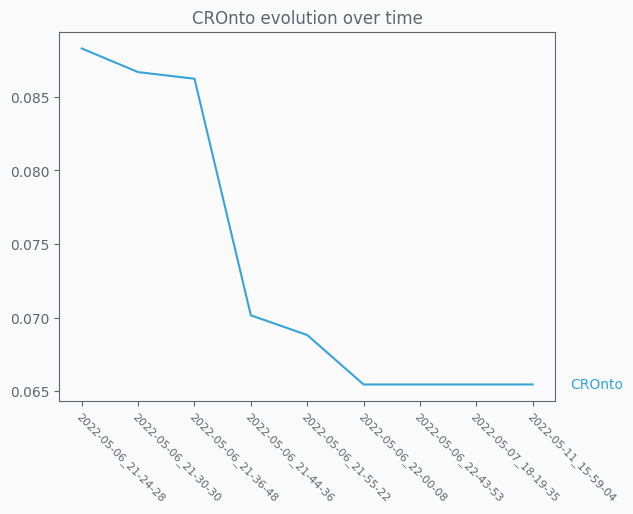

### DITOnto evolution

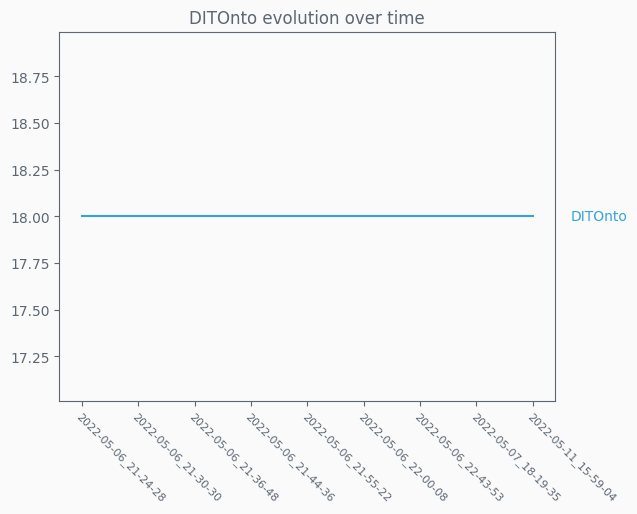

### INROnto evolution

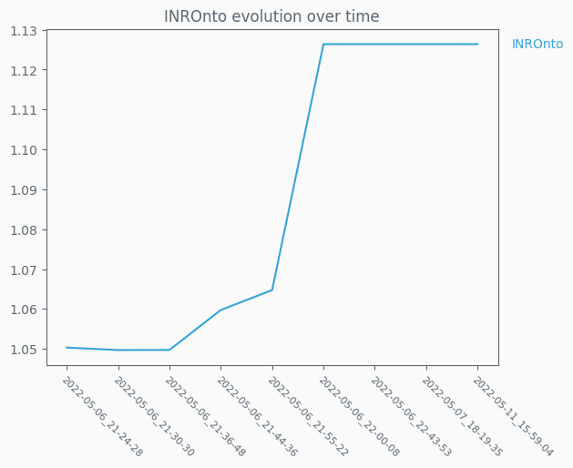

### LCOMOnto evolution

### NACOnto evolution

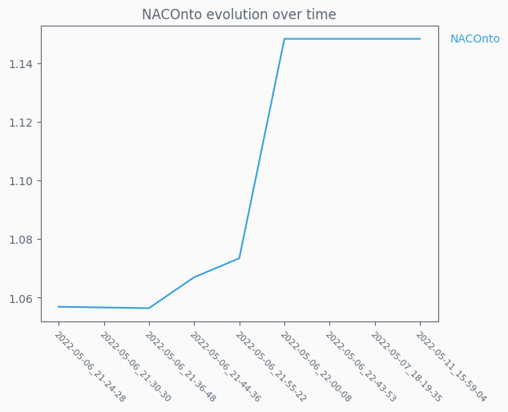

### NOCOnto evolution

### NOMOnto evolution

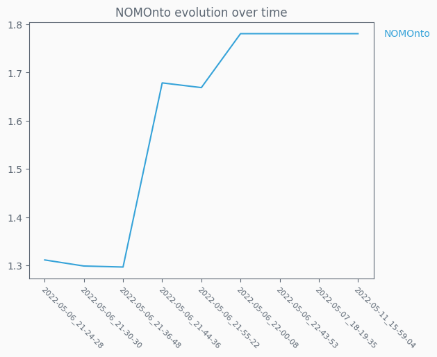

### POnto evolution

### PROnto evolution

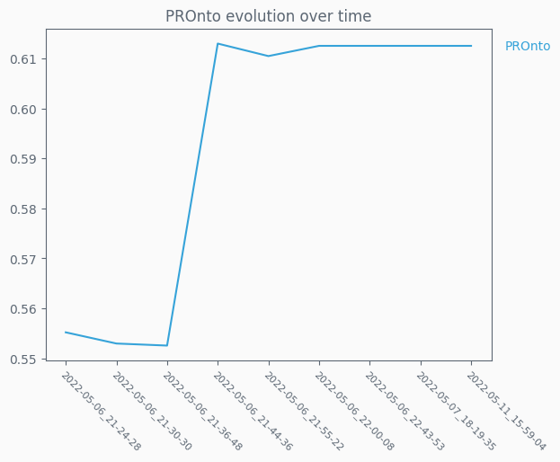

### RFCOnto evolution

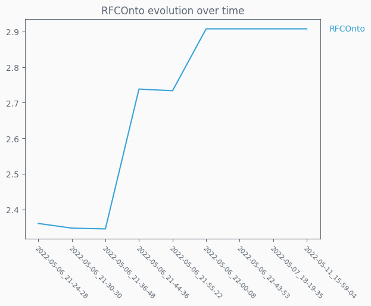

### RROnto evolution

### TMOnto evolution

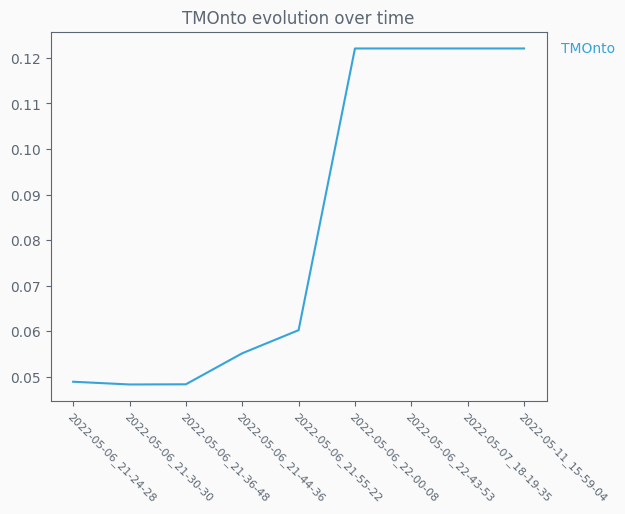

### TMOnto2 evolution

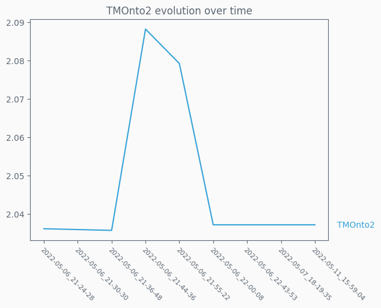

### WMCOnto evolution

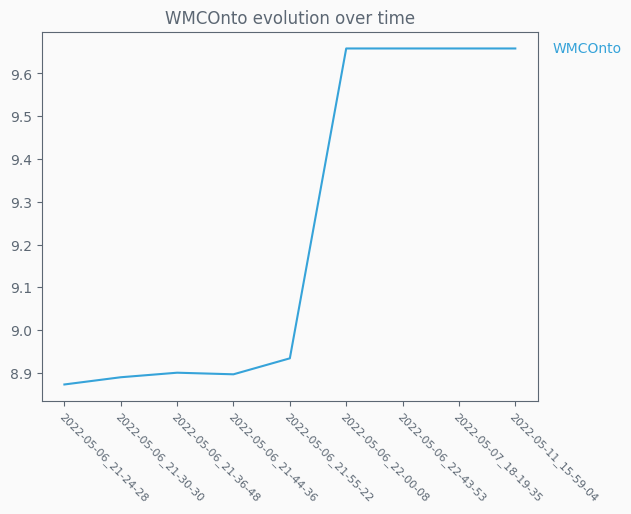

### WMCOnto2 evolution

