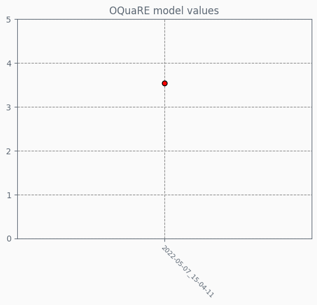

## OQuaRE category values
Each category has a value on a scale of 1 to 5, indicating how good the ontology is for each category

## OQuaRE subcategories metrics
Each category has a set of subcategories with metrics on a scale of 1 to 5, which makes up the category end value

## OQuaRE model value
Represents the quality of the ontology when taking in all the values obtained after evaluation across the latest 20 versions.On a scale of 1 to 5, 5 represents the highest quality attainable according to the OQuaRE framework

## OQuaRE category evolution
Evolution of each category overtime on a scale of 1 to 5

