## OQuaRE model value
Represents the quality of the ontology when taking in all the values obtained after evaluation across the latest 20 versions.On a scale of 1 to 5, 5 represents the highest quality attainable according to the OQuaRE framework

	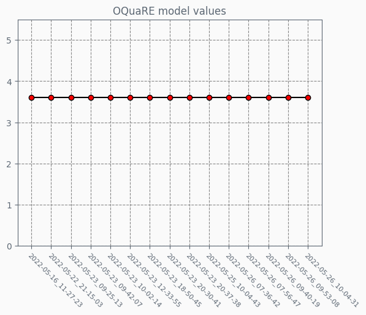

## OQuaRE category values
Each category has a value on a scale of 1 to 5, indicating how good the ontology is for each category

	

## OQuaRE category evolution
Evolution of each category overtime on a scale of 1 to 5

	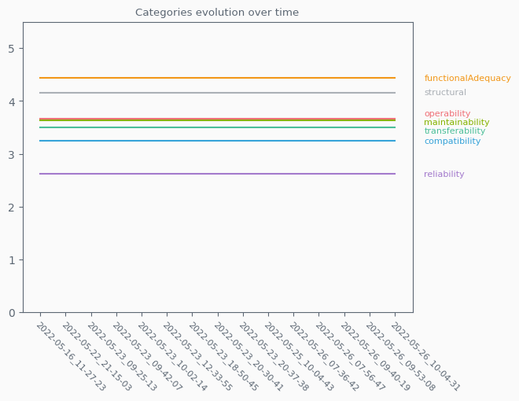

## OQuaRE subcategories metrics
Each category has a set of subcategories with metrics on a scale of 1 to 5, which makes up the category end value

	
	
	
	
	
	
	

## OQuaRE subcategories metrics evolution
Evolution of each category subcategories values overtime on a scale of 1 to 5

	
	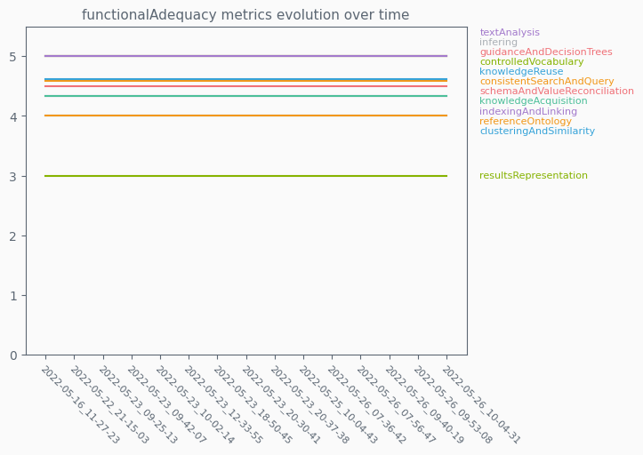
	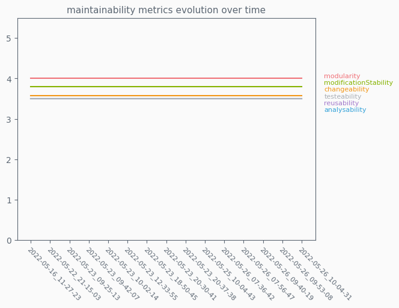
	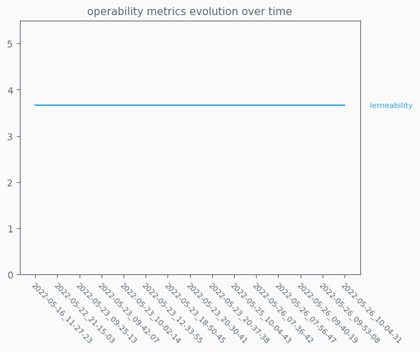
	
	
	

## OQuaRE metrics values
Fine grained metrics, lowest level of ontology analysis provided. Scaled version uses a 1 to 5 scale

	
	

## OQuaRE scaled metrics evolution
Evolution of each of the 19 scaled metrics obtained from an ontology

	

## OQuaRE metrics evolution
Evolution of each of the 19 metrics obtained from an ontology

<h3 align="center" width="100%"ANOnto evolution</h3>

	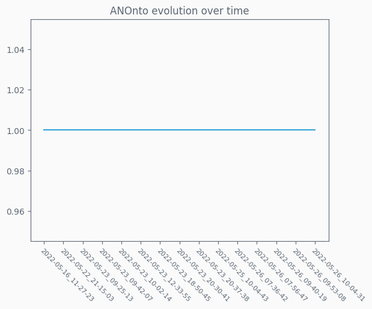

<h3 align="center" width="100%"AROnto evolution</h3>

	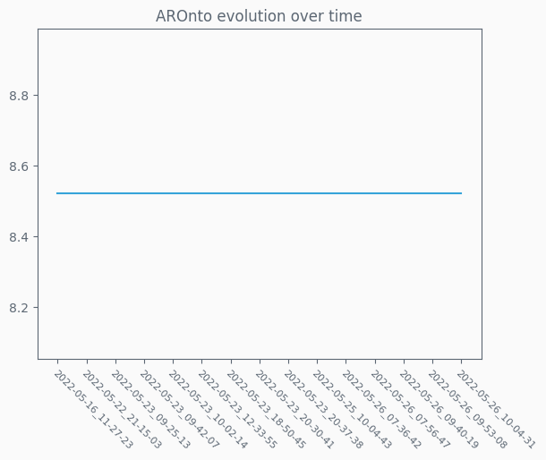

<h3 align="center" width="100%"CBOOnto evolution</h3>

	

<h3 align="center" width="100%"CBOnto2 evolution</h3>

	

<h3 align="center" width="100%"CROnto evolution</h3>

	

<h3 align="center" width="100%"DITOnto evolution</h3>

	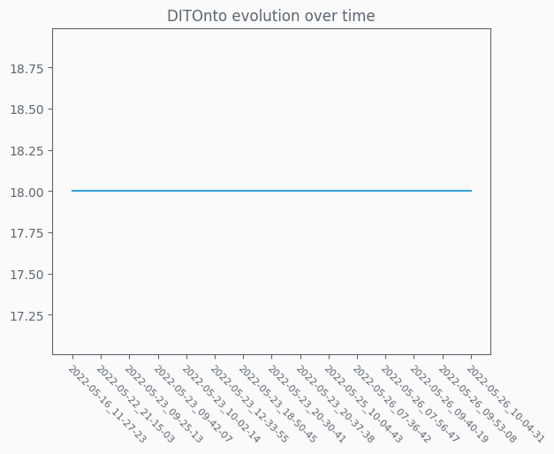

<h3 align="center" width="100%"INROnto evolution</h3>

	

<h3 align="center" width="100%"LCOMOnto evolution</h3>

	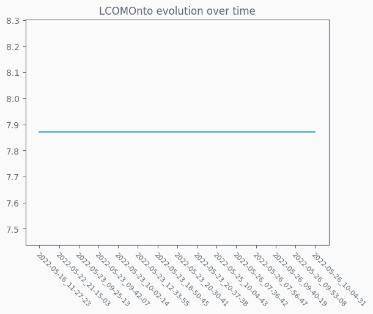

<h3 align="center" width="100%"NACOnto evolution</h3>

	

<h3 align="center" width="100%"NOCOnto evolution</h3>

	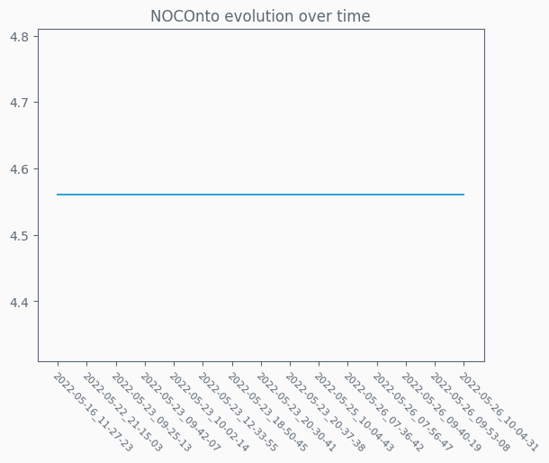

<h3 align="center" width="100%"NOMOnto evolution</h3>

	

<h3 align="center" width="100%"POnto evolution</h3>

	

<h3 align="center" width="100%"PROnto evolution</h3>

	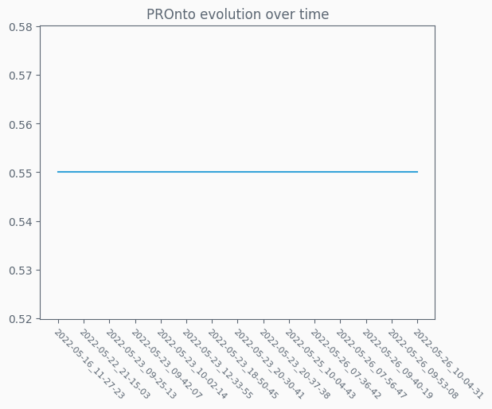

<h3 align="center" width="100%"RFCOnto evolution</h3>

	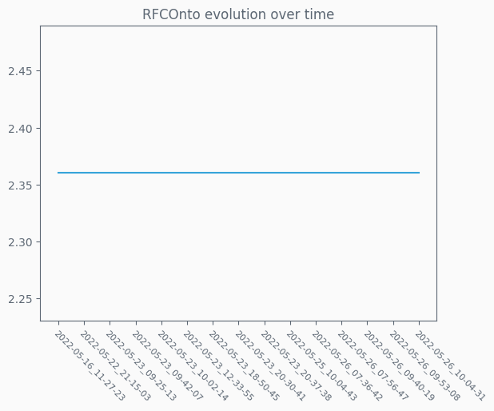

<h3 align="center" width="100%"RROnto evolution</h3>

	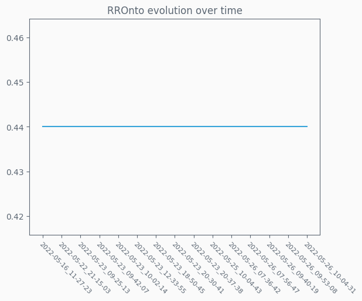

<h3 align="center" width="100%"TMOnto evolution</h3>

	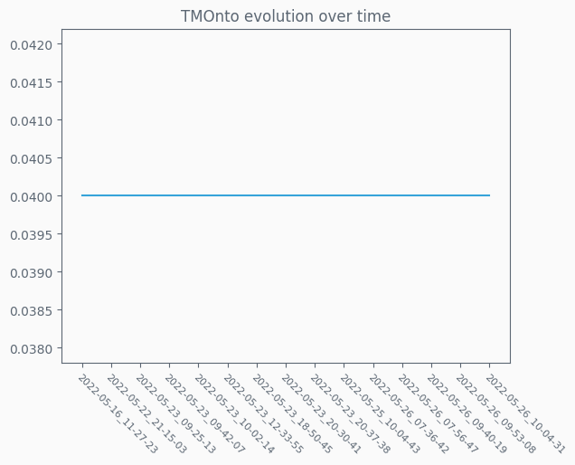

<h3 align="center" width="100%"TMOnto2 evolution</h3>

	

<h3 align="center" width="100%"WMCOnto evolution</h3>

	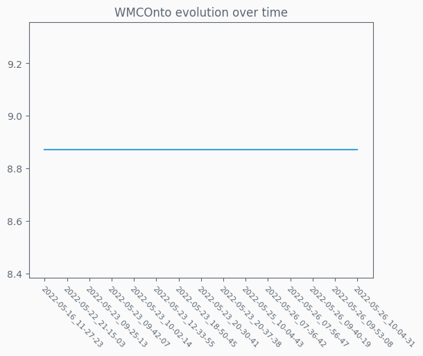

<h3 align="center" width="100%"WMCOnto2 evolution</h3>

	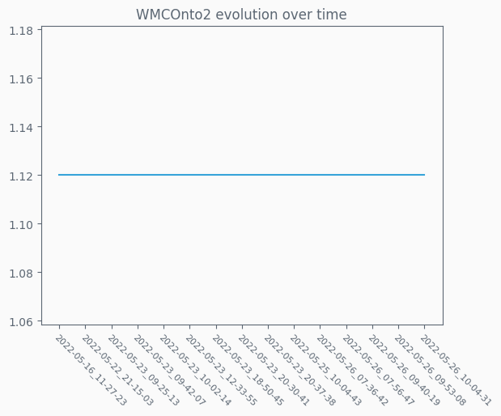

