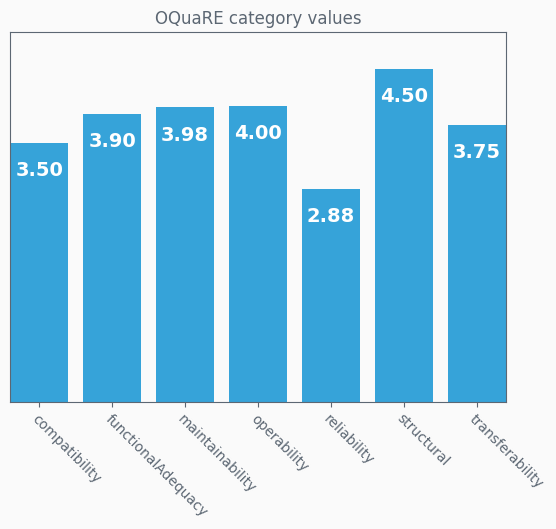

# OQuaRE category values
Each category has a value on a scale of 1 to 5, indicating how good the ontology is for each category

## OQuaRE subcategories metrics
Each category has a set of subcategories with metrics on a scale of 1 to 5, which makes up the category end value

